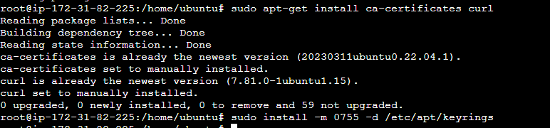
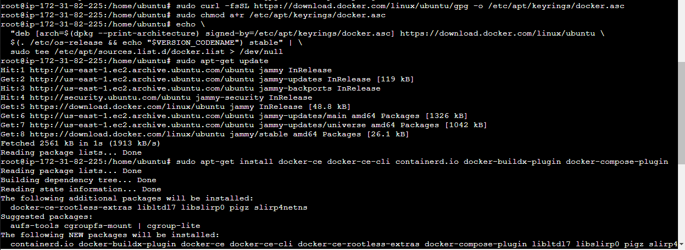
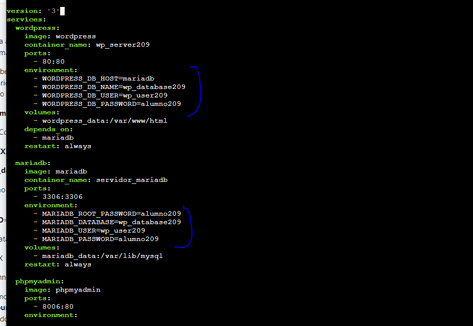

# Instalación de Dockers y Docker Compose + despliegue Wordpress

## Instalo Dockers en la instancia EC2 
### (he seguido los pasos del profesor):

### Comprobaré la instalación con el clásico hello-world:

## Creo el docker-compose.yml:

## Una vez creado lo inicio desde la misma carpeta con `docker compose up -d`:

## Entro a la IP pública de la instancia desde un navegador...

## Tras configurar las opciones basicas del wordpress...
### Funciona!

